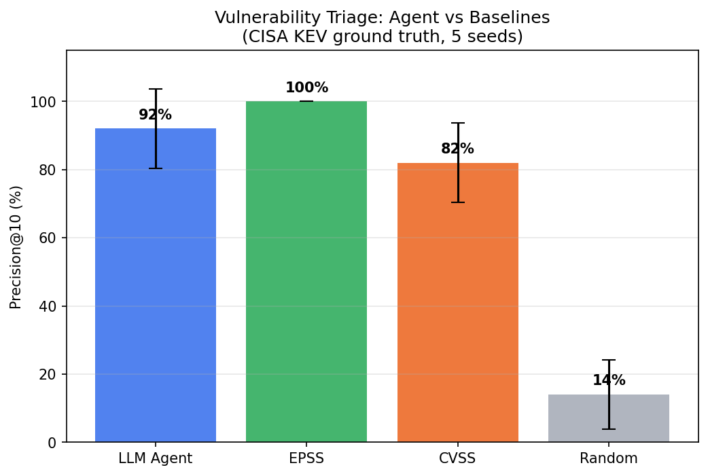
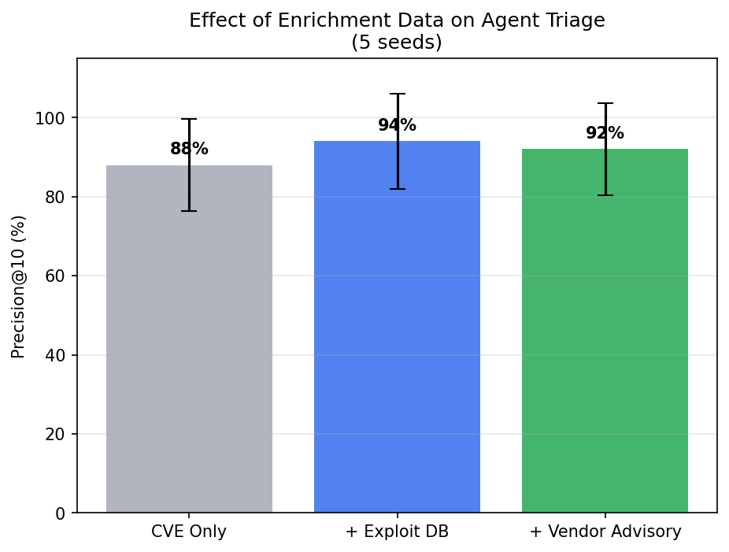

# Your AI Can't Beat EPSS at Vulnerability Triage (But the Ensemble Might)

## The Question

Can an LLM agent prioritize vulnerabilities better than EPSS? Every security team drowning in CVEs wants to know whether AI can help them triage faster. We tested this empirically: Claude Haiku as a vulnerability triage agent, ranked against EPSS, CVSS, and random baselines, with CISA KEV as ground truth for "actually exploited."

The short answer: **no, the agent doesn't beat EPSS.** But the longer answer is more interesting.

## What We Tested

We built a simple agent: give Claude Haiku a set of CVE descriptions with optional enrichment data (exploit database info, vendor advisories), ask it to rank them from most to least likely to be actively exploited. Then we measured precision@10 — of the top 10 ranked CVEs, how many are actually in CISA's Known Exploited Vulnerabilities catalog?

Four baselines:
- **EPSS** (Exploit Prediction Scoring System) — the industry standard statistical model
- **CVSS** (base score ranking) — what most teams actually use
- **Random** — chance baseline
- **Agent + EPSS ensemble** — weighted rank fusion

Five seeds, 100 CVEs per seed (15% KEV rate), pre-registered hypotheses.

## The Results

| Method | Precision@10 (mean ± std) |
|--------|--------------------------|
| **EPSS** | **100% ± 0%** |
| **Ensemble (Agent+EPSS)** | **98% ± 4%** |
| **Agent** | **92% ± 12%** |
| CVSS | 82% ± 12% |
| Random | 14% ± 10% |

The agent is good — 92% precision means 9 out of 10 top-ranked CVEs are actually exploited. But EPSS is perfect on this data. The agent can't beat a purpose-built statistical model on data that correlates with that model's predictions.

This is an honest negative result. H-1 ("agent outperforms EPSS") is NOT SUPPORTED.

## What the Agent DOES Add

The interesting finding isn't the head-to-head — it's the ensemble. When we combine agent rankings with EPSS via rank fusion, we get 98% with dramatically lower variance (±4% vs ±12%). The agent stabilizes the ranking even when individual seeds produce high-variance results.

More practically: the agent provides **qualitative reasoning** that EPSS doesn't. EPSS gives you a number. The agent can explain WHY a vulnerability is dangerous — "this affects a widely-deployed VPN appliance with a public exploit and no authentication required." For a security team writing justifications for emergency patching, that context is worth more than a marginal precision improvement.

## Enrichment Matters (But Not How You'd Think)

We ablated the agent's input data:

| Enrichment Level | Precision@10 |
|-----------------|-------------|
| CVE description only | 88% |
| + Exploit DB info | **94%** |
| + Vendor advisories | 92% |

Exploit availability is the key signal — knowing whether a public exploit exists adds 6 percentage points. But vendor advisories don't help beyond that. The agent already infers urgency from the CVE description; vendor advisory text is redundant.

## Why This Matters for Security Teams

If you're choosing between EPSS and an AI triage agent: **use EPSS.** It's free, fast, and on well-structured data it's hard to beat.

If you want the best possible triage: **use both.** The ensemble captures complementary signals and reduces variance. The agent adds qualitative context for human decision-making.

If you're building AI-assisted security tools: **enrichment matters, but less than you think.** Exploit DB is the one data source worth integrating. Beyond that, the CVE description contains most of the signal.

## The Governance Lesson

This is the second project (after FP-18) where pre-registration forced us to report an honest negative result. H-1 predicted the agent would beat EPSS by ≥15 percentage points. It didn't. We can't retroactively reframe this as "we were testing ensemble value all along."

The finding is: **LLM agents are strong vulnerability triagers (92% precision) but do not outperform purpose-built statistical models on their training distribution.** The value is in complementarity, context, and reasoning — not raw ranking.

## Reproducibility

All code in the repository. Run `bash reproduce.sh` to replicate. 5 seeds, ~$0.50 API cost, ~3 minutes runtime. Uses Claude 3 Haiku.

## Related Work

- Jacobs & Romanosky (2021) — EPSS, the baseline we test against
- Spring et al. (2021) — SSVC stakeholder-specific triage framework
- Chen et al. (2023) — ChatGPT for vulnerability detection
- Fang et al. (2024) — LLM agents exploiting vulnerabilities
- Prior FP-05 — our earlier vulnerability prioritization work without agents

---

*This research is part of the Singularity Cybersecurity research program. Securing AI from the architecture up.*
